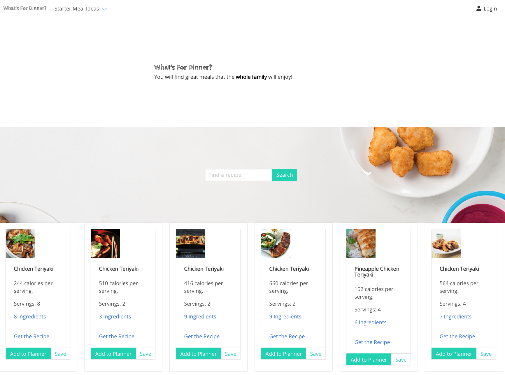
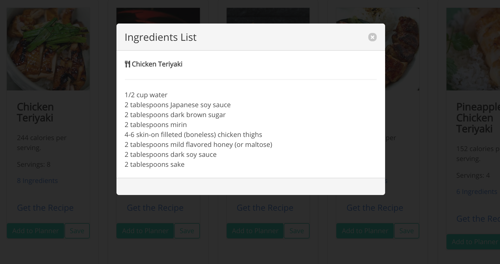
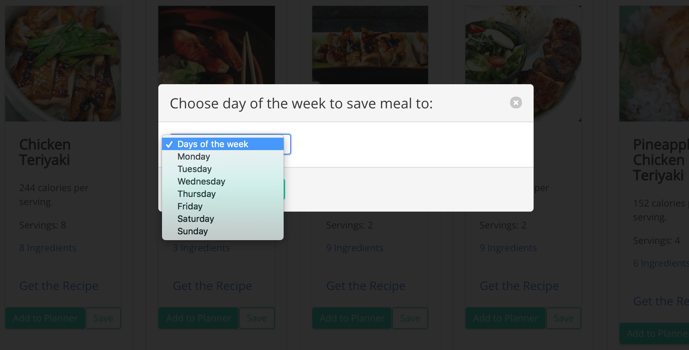
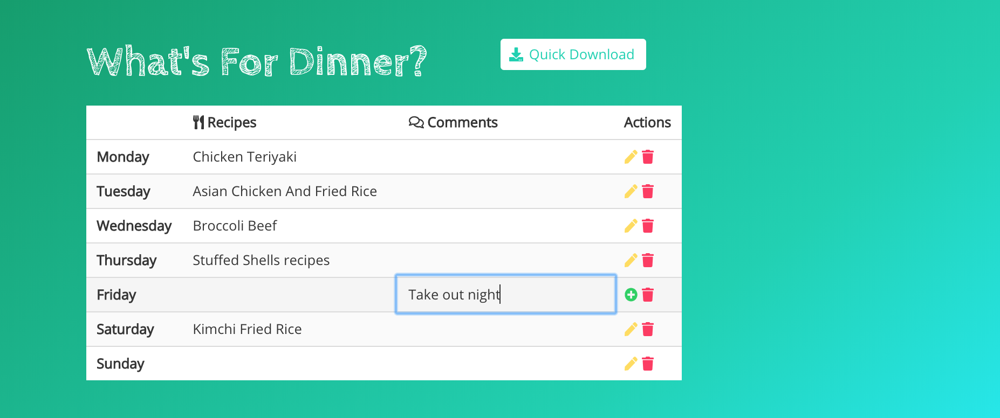
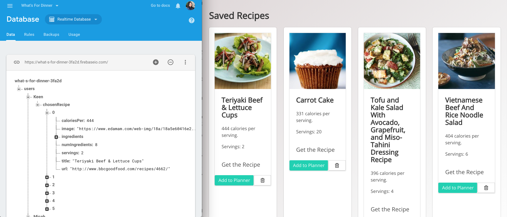
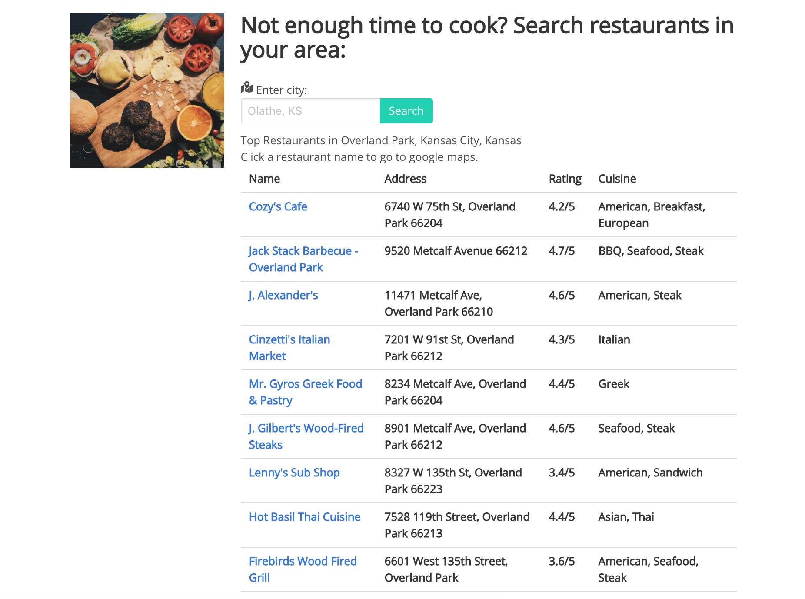

# What's For Dinner by _Group 5 Studio_

#### **A meal plan generator browser-based app** that allows the user to save searched recipes to weekly meal planner

---
## Product features

* The user can conveniently search recipes by using **starter meal ideas** (e.g. sheet pan recipes, 15-min cooking recipes) , or **random a menu** from our classic recipes list.

* If the user already has a meal idea, another option is to search that keyword in **our _find a recipe_ search bar**. The browser will display a collection of recipes with that keywords from the most popular recipe sources on the web. 

* The user can check out _ingredients list_ of each recipe. 

* Once the user finds a recipe they want to add to their weekly meal planner, the user can select it, then use **a drop-down menu** to add the recipe to a specific day of the week.

* The weekly meal planner will show a title and a link to each recipe's page. 
* The user can **edit recipe titles and comments** by using `actions` button.
* Once satisfied, the user can **quick download** a meal planner to an image and share it to family members.

* The user can save recipes to their log-in name. The list of their saved recipes will be stored in `firebase` realtime database.

* We understand that you might not want to cook everyday. Therefore, we have included a feature to search for top nearby restaurants in your city.
* The user can click a restaurant name to go to Google Maps.

---

### The Motivation for Development
The main problem that most busy parents with little kids have is that **they don't know what to feed their kids**. They know the important of meal planning. There are tons of free family meal planning templates they can find on Pinterest. However, they are too busy to sit down and plan a meal for the whole week. Most of all, One of the parents often has no clue what should the kids have for dinner. These parents just want something super easy, portable, and shareable. 

Wouldn't it be nice if someone (in this case, us as developers!) builds a meal plan generator that helps the user searchs and selects a recipe to a weekly meal planner, and be able to share it to other caregivers! 

---
## Technologies used
* [EDAMAM's Recipe Search API](https://developer.edamam.com/edamam-recipe-api) _returns recipes from popular recipes sources on the web_
* [ZOMATO API](https://developers.zomato.com/api) _returns restaurants in the area_
* [html2canvas JS](https://html2canvas.hertzen.com/) _takes screenshots with JavaScript_

---
## Direction for future development
* Customize random search generator with user's cooking habit preference i.e., home-cooking, store-bought, carry-out parents
* Add search filters by calories, diet or allergy restrictions
* Help the user manage household better by showing cost of total meal 
---
## Authors
**Group 5 Studio Team Members**
* [Victor Adams](https://kysper.github.io/)
* [Tim Lukens](https://timlukens.com/)
* [Micah Walker](https://mjwalker99.github.io/Basic-Portfolio/)
* [Keen Wilson](https://keenwilson.github.io/)

_This group project is part of the Full-Stack Web Development program at University of Kansas_
